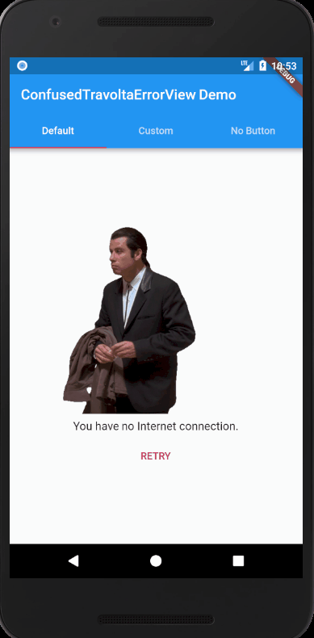

# confused_travolta_error_view

A fun way to display error view.

Display your error view composed of following components:

* An appropriate error gif. (Confused Travolta Gif)

* An error message. (Can be customized with `errorWidget`, `errorMessage`
and `errorMessageStyle`)

* A Retry button. [Optional] (Can be customized with `retryButton`,
`retryButtonText` and `onTapRetryButton`).
## Example



Using default values for error and button widgets:

```dart
 ConfusedTravoltaErrorView(
    errorMessage: 'You have no Internet connection.',
    onTapRetryButton: () {},
 )
```


Using custom error and button widgets:

```dart
 ConfusedTravoltaErrorView(
    errorText: Text(
        'Ooops! Something went wrong.',
        style: TextStyle(fontSize: 19.0),
    ),
    retryButton: RaisedButton(
        onPressed: () {},
        child: Text('Try again'.toUpperCase()),
        color: Colors.black38,
        textColor: Colors.white,
    ),
 )
```

Using without a button

```dart
ConfusedTravoltaErrorView(
    errorMessage: 'You have no favorites, yet.',
)
```

## Credits

[Confused Travolta Gif](https://media.giphy.com/media/jWexOOlYe241y/giphy.gif)